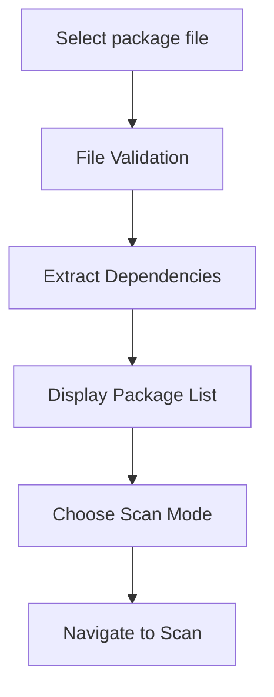
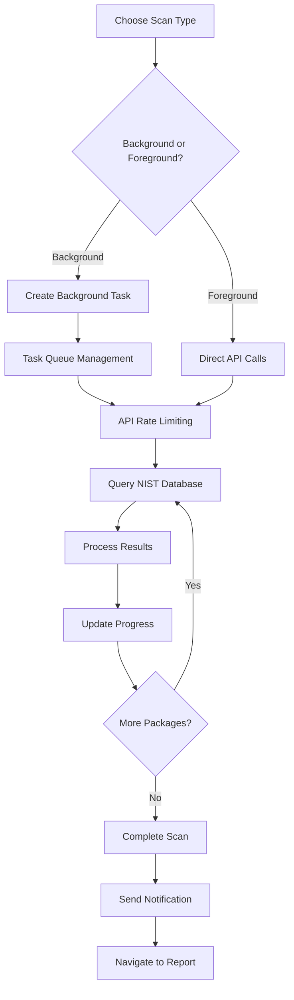
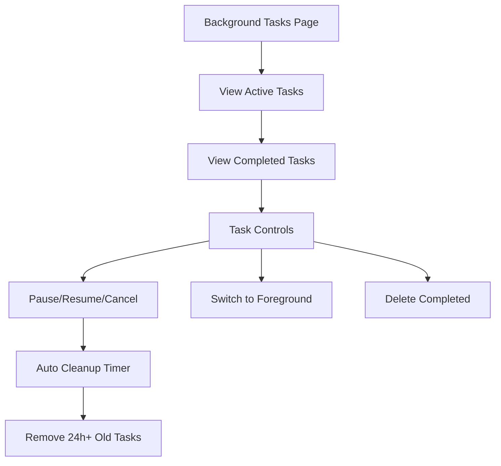
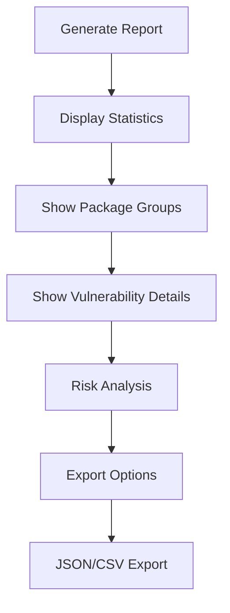

# CVE Security Scanner / CVE 安全掃描工具

[English](#english) | [繁體中文](#繁體中文)

---

## English

### Overview

A comprehensive security vulnerability scanner for Node.js projects that analyzes `package.json` and `package-lock.json` dependencies against the NIST CVE database. Built with Angular 17, this tool provides real-time vulnerability scanning, background task management, detailed reporting, and multiple export formats.

### Features

#### 🔍 **Vulnerability Scanning**
- **雙模式掃描**: 支援 API 掃描和本地資料庫掃描
- **本地資料庫**: 使用 IndexedDB 儲存完整的 NVD 資料庫副本
- **離線支援**: 本地掃描可在無網路連線時使用
- 整合 NIST 國家漏洞資料庫 (NVD)
- 支援 `package.json` 和 `package-lock.json` 檔案
- CVSS 評分和嚴重性分類（嚴重、高、中、低風險）
- 自動化 API 限制處理和重試機制

#### 🌙 **Background Scanning** ⭐ NEW
- **Non-blocking scans**: Continue using other features while scanning runs in background
- **Persistent progress**: Scan progress persists across page refreshes and browser restarts
- **Browser notifications**: Get notified when background scans complete
- **Task management**: View, pause, resume, or cancel background scans
- **Foreground switching**: Convert background scans to foreground view anytime

#### ⚡ **Smart Task Management** ⭐ NEW
- **Automatic cleanup**: Tasks older than 24 hours are automatically removed
- **Manual cleanup**: Instantly remove expired tasks with one click
- **Task persistence**: All task states saved to local storage
- **Real-time updates**: Task status updates across all browser tabs
- **Intelligent filtering**: Configurable scan modes (fast, balanced, comprehensive)

#### 📊 **Comprehensive Reporting**
- Interactive dashboard with vulnerability statistics
- Real-time progress tracking during scans
- Visual charts showing risk distribution
- Virtual scrolling for large datasets (performance optimized)
- Package grouping with collapsible panels
- Detailed vulnerability information including:
  - CVE identifiers and descriptions
  - CVSS scores and vectors
  - Publication and modification dates
  - Affected versions and fixes
  - Reference links

#### 📁 **Multiple Export Formats**
- **JSON**: Complete structured data with metadata
- **CSV**: Spreadsheet-compatible format for analysis
- All exports include scan timestamps and comprehensive metadata

#### 🎨 **User Interface**
- Modern Material Design interface with Indigo-Pink theme
- Responsive design for desktop and mobile
- Color-coded severity indicators
- Intuitive navigation with five main sections:
  - Upload: File upload and validation
  - Scan: Real-time scanning with progress
  - Report: Detailed analysis and export options
  - Background Tasks: Manage all background scans ⭐ NEW
  - Database: Local database management and synchronization ⭐ NEW

#### 🚀 **Performance Features**
- LRU caching system (24-hour TTL, 1000 item capacity)
- Intelligent API rate limiting with automatic backoff
- Virtual scrolling for handling thousands of vulnerabilities
- Progress tracking for long-running scans
- Error handling and retry mechanisms

### Quick Start

#### Prerequisites
- Node.js 18+ 
- npm or yarn package manager

#### Installation

```bash
# Clone the repository
git clone <repository-url>
cd cves-nist

# Install dependencies
npm install

# Start development server
npm start
```

The application will be available at `http://localhost:4300`

#### Usage

1. **Upload Package File**
   - Navigate to the upload page
   - Select your `package.json` or `package-lock.json` file
   - Choose scan configuration (fast/balanced/comprehensive)
   - The tool will validate and extract dependencies

2. **Choose Scan Mode**
   - **API Scan**: Online scanning using NIST API (requires internet)
   - **Local Scan** ⭐ NEW: Offline scanning using local database (faster)
   - **Foreground Scan**: Traditional blocking scan with immediate results
   - **Background Scan** ⭐ NEW: Non-blocking scan, continue using other features

3. **Setup Local Database** ⭐ NEW (Optional)
   - Access `/database` to manage local NVD database
   - Download and synchronize complete NVD dataset
   - Monitor sync progress and database status
   - Enable faster offline scanning capability

4. **Manage Background Tasks** ⭐ NEW
   - Access `/background-tasks` to view all scans
   - Pause, resume, or cancel running scans
   - Switch background scans to foreground view
   - View completed scan results

5. **View Report**
   - Access detailed vulnerability information
   - Browse by package groups or view all vulnerabilities
   - Read risk analysis and security recommendations

6. **Export Results**
   - Choose from JSON or CSV formats
   - All exports include scan timestamps
   - Download reports locally

### Local Database Benefits ⭐ NEW

- **Offline Capability**: Scan packages without internet connection
- **Superior Performance**: 10x faster than API scanning
- **No Rate Limits**: Unlimited concurrent scans
- **Data Completeness**: Full NVD dataset locally available
- **Privacy**: No external API calls during scanning

### Background Scanning Benefits ⭐ NEW

- **Productivity**: Don't wait for long scans to complete
- **Flexibility**: Switch between scans and other tasks seamlessly  
- **Reliability**: Scans continue even if you navigate away
- **Notifications**: Get alerted when scans finish
- **Persistence**: Resume interrupted scans after browser restart

### Technical Stack

- **Frontend**: Angular 17 (Standalone Components)
- **UI Components**: Angular Material 17
- **Charts**: Chart.js with ng2-charts
- **Reactive Programming**: RxJS
- **Styling**: SCSS
- **Testing**: Karma + Jasmine
- **API**: NIST CVE Database REST API
- **Local Database**: IndexedDB for NVD data storage
- **Workers**: Web Workers for database operations
- **Storage**: Browser LocalStorage for task persistence

### Architecture

```
src/app/
├── core/                    # Core services and models
│   ├── interfaces/          # TypeScript interfaces
│   ├── models/             # Data models
│   └── services/           # Business logic services
│       ├── background-scan.service.ts  # Background task management ⭐ NEW
│       ├── cache.service.ts            # LRU caching system
│       ├── file-parser.service.ts      # File parsing logic
│       ├── nist-api.service.ts         # NIST API integration
│       ├── local-scan.service.ts       # Local database scanning ⭐ NEW
│       ├── nvd-database.service.ts     # IndexedDB management ⭐ NEW
│       ├── nvd-download.service.ts     # NVD data download ⭐ NEW
│       ├── nvd-parser.service.ts       # NVD data parsing ⭐ NEW
│       ├── nvd-sync.service.ts         # Database synchronization ⭐ NEW
│       ├── database-worker.service.ts  # Web Worker management ⭐ NEW
│       ├── report-export.service.ts    # Export functionality
│       └── version-recommendation.service.ts  # Version recommendations
├── features/               # Feature modules
│   ├── upload/            # File upload component
│   ├── scan/              # Scanning interface
│   ├── report/            # Reporting dashboard
│   ├── background-tasks/  # Background task management ⭐ NEW
│   └── database-management/ # Local database management ⭐ NEW
└── shared/                # Shared components
    ├── components/        # Reusable UI components
    │   ├── loading-overlay.component.ts        # Loading indicator ⭐ NEW
    │   ├── vulnerability-detail.component.ts
    │   ├── virtual-scroll-packages.component.ts
    │   └── virtual-scroll-vulnerabilities.component.ts
    └── material/          # Material Design modules
```

### Development Commands

```bash
# Development server (running on port 4300)
npm start

# Build for production
npm run build

# Run tests
npm test

# Build with file watching
npm run watch
```

### API Integration

The application integrates with the NIST CVE database API:
- Base URL: `https://services.nvd.nist.gov/rest/json/cves/2.0`
- Rate limiting: 10 requests per minute (7-second intervals)
- Caching: 24-hour TTL with LRU eviction
- Error handling: Graceful degradation and retry logic

### Contributing

1. Fork the repository
2. Create a feature branch (`git checkout -b feature/amazing-feature`)
3. Commit your changes (`git commit -m 'Add amazing feature'`)
4. Push to the branch (`git push origin feature/amazing-feature`)
5. Open a Pull Request

### License

This project is licensed under the MIT License - see the LICENSE file for details.

---

## 繁體中文

### 概述

這是一個針對 Node.js 專案的綜合性安全漏洞掃描工具，能夠分析 `package.json` 和 `package-lock.json` 相依性套件並與 NIST CVE 資料庫進行比對。使用 Angular 17 建構，提供即時漏洞掃描、背景任務管理、詳細報告和多種匯出格式。

### 功能特色

#### 🔍 **漏洞掃描**
- **雙模式掃描**: 支援 API 掃描和本地資料庫掃描
- **本地資料庫**: 使用 IndexedDB 儲存完整的 NVD 資料庫副本
- **離線支援**: 本地掃描可在無網路連線時使用
- 整合 NIST 國家漏洞資料庫 (NVD)
- 支援 `package.json` 和 `package-lock.json` 檔案
- CVSS 評分和嚴重性分類（嚴重、高、中、低風險）
- 自動化 API 限制處理和重試機制

#### 🌙 **背景掃描** ⭐ 全新功能
- **非阻塞掃描**：掃描期間可繼續使用其他功能
- **持久性進度**：進度在頁面重新整理和瀏覽器重啟後保持
- **瀏覽器通知**：背景掃描完成時收到通知
- **任務管理**：查看、暫停、繼續或取消背景掃描
- **前景切換**：隨時將背景掃描切換為前景顯示

#### ⚡ **智慧任務管理** ⭐ 全新功能
- **自動清理**：超過 24 小時的任務自動移除
- **手動清理**：一鍵立即移除過期任務
- **任務持久化**：所有任務狀態保存至本地儲存
- **即時更新**：任務狀態在所有瀏覽器分頁間即時更新
- **智慧過濾**：可配置的掃描模式（快速、平衡、完整）

#### 📊 **全面性報告**
- 互動式儀表板顯示漏洞統計
- 掃描過程中的即時進度追蹤
- 視覺化圖表顯示風險分佈
- 大型資料集的虛擬捲動（效能最佳化）
- 套件分組顯示與折疊面板
- 詳細漏洞資訊包含：
  - CVE 識別碼和描述
  - CVSS 分數和向量
  - 發布和修改日期
  - 受影響版本和修復資訊
  - 相關參考連結

#### 📁 **多種匯出格式**
- **JSON**：完整結構化資料含中繼資料
- **CSV**：相容試算表的分析格式
- 所有匯出皆包含掃描時間戳記和完整中繼資料

#### 🎨 **使用者介面**
- 現代化 Material Design 介面（Indigo-Pink 主題）
- 響應式設計支援桌面和行動裝置
- 顏色編碼的嚴重性指示器
- 直觀的五階段導航：
  - 上傳：檔案上傳和驗證
  - 掃描：即時掃描含進度顯示
  - 報告：詳細分析和匯出選項
  - 背景任務：管理所有背景掃描 ⭐ 全新功能
  - 資料庫：本地資料庫管理與同步 ⭐ 全新功能

#### 🚀 **效能特色**
- LRU 快取系統（24小時 TTL，1000 項目容量）
- 智慧型 API 限制處理含自動退避機制
- 虛擬捲動處理數千個漏洞
- 長時間掃描的進度追蹤
- 錯誤處理和重試機制

### 快速開始

#### 系統需求
- Node.js 18+ 
- npm 或 yarn 套件管理器

#### 安裝步驟

```bash
# 複製儲存庫
git clone <repository-url>
cd cves-nist

# 安裝相依性套件
npm install

# 啟動開發伺服器
npm start
```

應用程式將在 `http://localhost:4300` 提供服務

#### 使用方法

1. **上傳套件檔案**
   - 導航至上傳頁面
   - 選擇您的 `package.json` 或 `package-lock.json` 檔案
   - 選擇掃描配置（快速/平衡/完整）
   - 工具會驗證並提取相依性套件

2. **選擇掃描模式**
   - **API 掃描**：線上掃描使用 NIST API（需要網路連線）
   - **本地掃描** ⭐ 全新功能：離線掃描使用本地資料庫（更快速）
   - **前景掃描**：傳統阻塞式掃描，立即顯示結果
   - **背景掃描** ⭐ 全新功能：非阻塞掃描，可繼續使用其他功能

3. **設定本地資料庫** ⭐ 全新功能（選用）
   - 造訪 `/database` 頁面管理本地 NVD 資料庫
   - 下載並同步完整的 NVD 資料集
   - 監控同步進度和資料庫狀態
   - 啟用更快速的離線掃描功能

4. **管理背景任務** ⭐ 全新功能
   - 造訪 `/background-tasks` 頁面查看所有掃描
   - 暫停、繼續或取消執行中的掃描
   - 將背景掃描切換為前景顯示
   - 檢視已完成的掃描結果

5. **檢視報告**
   - 存取詳細漏洞資訊
   - 依套件群組瀏覽或檢視所有漏洞
   - 閱讀風險分析和安全建議

6. **匯出結果**
   - 選擇 JSON 或 CSV 格式
   - 所有匯出皆包含掃描時間戳記
   - 本地下載報告檔案

### 本地資料庫優勢 ⭐ 全新功能

- **離線能力**：無網路連線時也可掃描套件
- **卓越效能**：比 API 掃描快 10 倍
- **無速率限制**：可無限制並行掃描
- **資料完整性**：本地擁有完整的 NVD 資料集
- **隱私保護**：掃描期間無外部 API 呼叫

### 背景掃描優勢 ⭐ 全新功能

- **生產力提升**：不需等待長時間掃描完成
- **靈活彈性**：掃描和其他任務間無縫切換
- **可靠性**：即使離開頁面掃描仍持續進行
- **通知功能**：掃描完成時收到提醒
- **持久性**：瀏覽器重啟後可恢復中斷的掃描

### 技術堆疊

- **前端框架**：Angular 17（獨立元件）
- **UI 元件**：Angular Material 17
- **圖表**：Chart.js 搭配 ng2-charts
- **響應式程式設計**：RxJS
- **樣式**：SCSS
- **測試**：Karma + Jasmine
- **API**：NIST CVE 資料庫 REST API
- **本地資料庫**：IndexedDB 用於 NVD 資料儲存
- **工作執行緒**：Web Workers 處理資料庫操作
- **儲存**：瀏覽器 LocalStorage 用於任務持久化

### 架構設計

```
src/app/
├── core/                    # 核心服務和模型
│   ├── interfaces/          # TypeScript 介面
│   ├── models/             # 資料模型
│   └── services/           # 業務邏輯服務
│       ├── background-scan.service.ts  # 背景任務管理 ⭐ 全新功能
│       ├── cache.service.ts            # LRU 快取系統
│       ├── file-parser.service.ts      # 檔案解析邏輯
│       ├── nist-api.service.ts         # NIST API 整合
│       ├── local-scan.service.ts       # 本地資料庫掃描 ⭐ 全新功能
│       ├── nvd-database.service.ts     # IndexedDB 管理 ⭐ 全新功能
│       ├── nvd-download.service.ts     # NVD 資料下載 ⭐ 全新功能
│       ├── nvd-parser.service.ts       # NVD 資料解析 ⭐ 全新功能
│       ├── nvd-sync.service.ts         # 資料庫同步 ⭐ 全新功能
│       ├── database-worker.service.ts  # Web Worker 管理 ⭐ 全新功能
│       ├── report-export.service.ts    # 匯出功能
│       └── version-recommendation.service.ts  # 版本建議
├── features/               # 功能模組
│   ├── upload/            # 檔案上傳元件
│   ├── scan/              # 掃描介面
│   ├── report/            # 報告儀表板
│   ├── background-tasks/  # 背景任務管理 ⭐ 全新功能
│   └── database-management/ # 本地資料庫管理 ⭐ 全新功能
└── shared/                # 共用元件
    ├── components/        # 可重用 UI 元件
    │   ├── loading-overlay.component.ts        # 載入指示器 ⭐ 全新功能
    │   ├── vulnerability-detail.component.ts
    │   ├── virtual-scroll-packages.component.ts
    │   └── virtual-scroll-vulnerabilities.component.ts
    └── material/          # Material Design 模組
```

### 開發指令

```bash
# 開發伺服器（執行於 4300 連接埠）
npm start

# 正式環境建置
npm run build

# 執行測試
npm test

# 監視模式建置
npm run watch
```

### API 整合

應用程式整合 NIST CVE 資料庫 API：
- 基礎 URL：`https://services.nvd.nist.gov/rest/json/cves/2.0`
- 限制處理：每分鐘 10 次請求（7 秒間隔）
- 快取機制：24小時 TTL 含 LRU 淘汰策略
- 錯誤處理：優雅降級和重試邏輯

### 安全考量

#### 防護措施
- 僅進行防禦性安全分析
- 不生成或改進可能被惡意使用的代碼
- 專注於漏洞檢測和風險評估
- 提供安全建議和修復指引

#### 資料隱私
- 不收集或儲存敏感資訊
- 本地處理套件資訊
- API 查詢僅使用套件名稱
- 報告匯出為本地檔案
- 任務資料僅存儲於本地瀏覽器

### 貢獻指南

1. Fork 儲存庫
2. 建立功能分支 (`git checkout -b feature/amazing-feature`)
3. 提交變更 (`git commit -m 'Add amazing feature'`)
4. 推送至分支 (`git push origin feature/amazing-feature`)
5. 開啟 Pull Request

### 授權條款

此專案採用 MIT 授權 - 詳情請參閱 LICENSE 檔案。

---

## Workflow / 工作流程

### 1. Upload Stage / 上傳階段


### 2. Scanning Stage / 掃描階段


### 3. Background Task Management / 背景任務管理 ⭐ NEW


### 4. Reporting Stage / 報告階段


---

## Changelog / 更新日誌

### v3.0.0 (Current) ⭐ Local Database Scanning
- ✅ **Local database scanning**: Complete NVD database stored in IndexedDB
- ✅ **Offline capability**: Scan packages without internet connection
- ✅ **Database synchronization**: Download and sync complete NVD dataset
- ✅ **Web Workers**: Background database operations for better performance
- ✅ **Dual scan modes**: Choose between API and local database scanning
- ✅ **Database management UI**: Comprehensive local database management page
- ✅ **Loading overlays**: Enhanced user feedback during long operations

### v2.1.0 (Previous) ⭐ Enhanced Features
- ✅ **Version recommendation system**: Smart suggestions for vulnerable packages
- ✅ **Package grouping**: Organized display with collapsible sections
- ✅ **Virtual scrolling improvements**: Better performance for large datasets
- ✅ **Enhanced file parsing**: Improved support for various package formats
- ✅ **UI/UX enhancements**: Better visual indicators and user experience

### v2.0.0 (Previous) ⭐ Major Update
- ✅ **Background scanning system**: Non-blocking scans with task management
- ✅ **Persistent task states**: Tasks survive page refreshes and browser restarts  
- ✅ **Browser notifications**: Get notified when background scans complete
- ✅ **Automatic task cleanup**: Tasks older than 24 hours automatically removed
- ✅ **Task management UI**: Comprehensive background task management page
- ✅ **Foreground switching**: Convert background tasks to foreground view

### v1.0.0 (Initial)
- ✅ Complete NIST API integration
- ✅ Real-time vulnerability scanning
- ✅ Comprehensive reporting dashboard
- ✅ Multiple export formats (JSON, CSV)
- ✅ LRU caching system
- ✅ Automatic rate limiting with retry logic

---

**Built with ❤️ using Angular and Material Design**  
**使用 Angular 和 Material Design 用心建構**

**⭐ Now with Local Database Scanning - Offline & Lightning Fast!**  
**⭐ 現在支援本地資料庫掃描 - 離線且閃電般快速！**