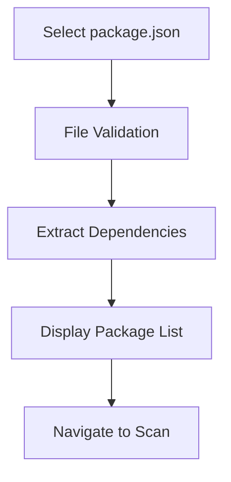
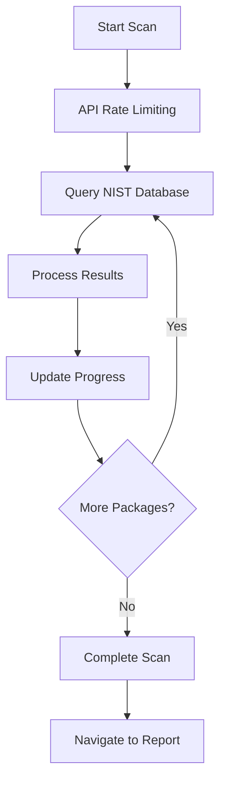
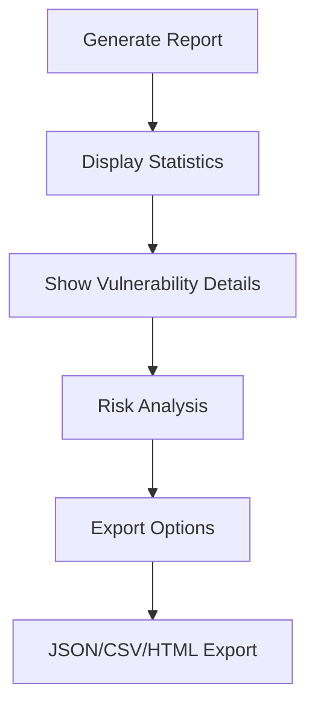

# CVE Security Scanner / CVE 安全掃描工具

[English](#english) | [繁體中文](#繁體中文)

---

## English

### Overview

A comprehensive security vulnerability scanner for Node.js projects that analyzes `package.json` dependencies against the NIST CVE database. Built with Angular 17, this tool provides real-time vulnerability scanning, detailed reporting, and multiple export formats.

### Features

#### 🔍 **Vulnerability Scanning**
- Real-time scanning of npm package dependencies
- Integration with NIST National Vulnerability Database (NVD)
- CVSS scoring and severity classification (Critical, High, Medium, Low)
- Automatic rate limiting and retry mechanisms for API reliability

#### 📊 **Comprehensive Reporting**
- Interactive dashboard with vulnerability statistics
- Real-time progress tracking during scans
- Visual charts showing risk distribution
- Detailed vulnerability information including:
  - CVE identifiers and descriptions
  - CVSS scores and vectors
  - Publication and modification dates
  - Affected versions and fixes
  - Reference links

#### 📁 **Multiple Export Formats**
- **JSON**: Complete structured data with metadata
- **CSV**: Spreadsheet-compatible format for analysis
- **HTML**: Professional report with styling and charts
- All exports include scan timestamps and comprehensive metadata

#### 🎨 **User Interface**
- Modern Material Design interface
- Responsive design for desktop and mobile
- Color-coded severity indicators
- Intuitive navigation with three main sections:
  - Upload: File upload and validation
  - Scan: Real-time scanning with progress
  - Report: Detailed analysis and export options

#### 🚀 **Performance Features**
- LRU caching system (24-hour TTL, 1000 item capacity)
- Intelligent API rate limiting with automatic backoff
- Progress tracking for long-running scans
- Error handling and retry mechanisms

### Quick Start

#### Prerequisites
- Node.js 18+ 
- npm or yarn package manager

#### Installation

```bash
# Clone the repository
git clone <repository-url>
cd cves-nist

# Install dependencies
npm install

# Start development server
npm start
```

The application will be available at `http://localhost:4200`

#### Usage

1. **Upload Package File**
   - Navigate to the upload page
   - Select your `package.json` file
   - The tool will validate and extract dependencies

2. **Run Security Scan**
   - Review detected packages
   - Click "Start Scan" to begin vulnerability analysis
   - Monitor real-time progress and results

3. **View Report**
   - Access detailed vulnerability information
   - Browse by package or view all vulnerabilities
   - Read risk analysis and security recommendations

4. **Export Results**
   - Choose from JSON, CSV, or HTML formats
   - All exports include scan timestamps
   - Professional HTML reports with styling

### Technical Stack

- **Frontend**: Angular 17 (Standalone Components)
- **UI Components**: Angular Material 17
- **Charts**: Chart.js with ng2-charts
- **Reactive Programming**: RxJS
- **Styling**: SCSS
- **Testing**: Karma + Jasmine
- **API**: NIST CVE Database REST API

### Architecture

```
src/app/
├── core/                    # Core services and models
│   ├── interfaces/          # TypeScript interfaces
│   ├── models/             # Data models
│   └── services/           # Business logic services
├── features/               # Feature modules
│   ├── upload/            # File upload component
│   ├── scan/              # Scanning interface
│   └── report/            # Reporting dashboard
└── shared/                # Shared components
    ├── components/        # Reusable UI components
    └── material/          # Material Design modules
```

### Development Commands

```bash
# Development server
npm start

# Build for production
npm run build

# Run tests
npm test

# Build with file watching
npm run watch
```

### API Integration

The application integrates with the NIST CVE database API:
- Base URL: `https://services.nvd.nist.gov/rest/json/cves/2.0`
- Rate limiting: Automatic handling with exponential backoff
- Caching: 24-hour TTL with LRU eviction
- Error handling: Graceful degradation and retry logic

### Contributing

1. Fork the repository
2. Create a feature branch (`git checkout -b feature/amazing-feature`)
3. Commit your changes (`git commit -m 'Add amazing feature'`)
4. Push to the branch (`git push origin feature/amazing-feature`)
5. Open a Pull Request

### License

This project is licensed under the MIT License - see the LICENSE file for details.

---

## 繁體中文

### 概述

這是一個針對 Node.js 專案的綜合性安全漏洞掃描工具，能夠分析 `package.json` 相依性套件並與 NIST CVE 資料庫進行比對。使用 Angular 17 建構，提供即時漏洞掃描、詳細報告和多種匯出格式。

### 功能特色

#### 🔍 **漏洞掃描**
- 即時掃描 npm 套件相依性
- 整合 NIST 國家漏洞資料庫 (NVD)
- CVSS 評分和嚴重性分類（嚴重、高、中、低風險）
- 自動化 API 限制處理和重試機制

#### 📊 **全面性報告**
- 互動式儀表板顯示漏洞統計
- 掃描過程中的即時進度追蹤
- 視覺化圖表顯示風險分佈
- 詳細漏洞資訊包含：
  - CVE 識別碼和描述
  - CVSS 分數和向量
  - 發布和修改日期
  - 受影響版本和修復資訊
  - 相關參考連結

#### 📁 **多種匯出格式**
- **JSON**：完整結構化資料含中繼資料
- **CSV**：相容試算表的分析格式
- **HTML**：專業報告含樣式和圖表
- 所有匯出皆包含掃描時間戳記和完整中繼資料

#### 🎨 **使用者介面**
- 現代化 Material Design 介面
- 響應式設計支援桌面和行動裝置
- 顏色編碼的嚴重性指示器
- 直觀的三階段導航：
  - 上傳：檔案上傳和驗證
  - 掃描：即時掃描含進度顯示
  - 報告：詳細分析和匯出選項

#### 🚀 **效能特色**
- LRU 快取系統（24小時 TTL，1000 項目容量）
- 智慧型 API 限制處理含自動退避機制
- 長時間掃描的進度追蹤
- 錯誤處理和重試機制

### 快速開始

#### 系統需求
- Node.js 18+ 
- npm 或 yarn 套件管理器

#### 安裝步驟

```bash
# 複製儲存庫
git clone <repository-url>
cd cves-nist

# 安裝相依性套件
npm install

# 啟動開發伺服器
npm start
```

應用程式將在 `http://localhost:4200` 提供服務

#### 使用方法

1. **上傳套件檔案**
   - 導航至上傳頁面
   - 選擇您的 `package.json` 檔案
   - 工具會驗證並提取相依性套件

2. **執行安全掃描**
   - 檢視偵測到的套件
   - 點擊「開始掃描」進行漏洞分析
   - 監控即時進度和結果

3. **檢視報告**
   - 存取詳細漏洞資訊
   - 依套件瀏覽或檢視所有漏洞
   - 閱讀風險分析和安全建議

4. **匯出結果**
   - 選擇 JSON、CSV 或 HTML 格式
   - 所有匯出皆包含掃描時間戳記
   - 專業 HTML 報告含樣式設計

### 技術堆疊

- **前端框架**：Angular 17（獨立元件）
- **UI 元件**：Angular Material 17
- **圖表**：Chart.js 搭配 ng2-charts
- **響應式程式設計**：RxJS
- **樣式**：SCSS
- **測試**：Karma + Jasmine
- **API**：NIST CVE 資料庫 REST API

### 架構設計

```
src/app/
├── core/                    # 核心服務和模型
│   ├── interfaces/          # TypeScript 介面
│   ├── models/             # 資料模型
│   └── services/           # 業務邏輯服務
├── features/               # 功能模組
│   ├── upload/            # 檔案上傳元件
│   ├── scan/              # 掃描介面
│   └── report/            # 報告儀表板
└── shared/                # 共用元件
    ├── components/        # 可重用 UI 元件
    └── material/          # Material Design 模組
```

### 開發指令

```bash
# 開發伺服器
npm start

# 正式環境建置
npm run build

# 執行測試
npm test

# 監視模式建置
npm run watch
```

### API 整合

應用程式整合 NIST CVE 資料庫 API：
- 基礎 URL：`https://services.nvd.nist.gov/rest/json/cves/2.0`
- 限制處理：含指數退避的自動處理
- 快取機制：24小時 TTL 含 LRU 淘汰策略
- 錯誤處理：優雅降級和重試邏輯

### 安全考量

#### 防護措施
- 僅進行防禦性安全分析
- 不生成或改進可能被惡意使用的代碼
- 專注於漏洞檢測和風險評估
- 提供安全建議和修復指引

#### 資料隱私
- 不收集或儲存敏感資訊
- 本地處理套件資訊
- API 查詢僅使用套件名稱
- 報告匯出為本地檔案

### 貢獻指南

1. Fork 儲存庫
2. 建立功能分支 (`git checkout -b feature/amazing-feature`)
3. 提交變更 (`git commit -m 'Add amazing feature'`)
4. 推送至分支 (`git push origin feature/amazing-feature`)
5. 開啟 Pull Request

### 授權條款

此專案採用 MIT 授權 - 詳情請參閱 LICENSE 檔案。

---

## Workflow / 工作流程

### 1. Upload Stage / 上傳階段


### 2. Scanning Stage / 掃描階段


### 3. Reporting Stage / 報告階段


---

## Support / 支援

For issues and questions, please:
如有問題請：

- 🐛 [Report bugs / 回報錯誤](https://github.com/your-repo/issues)
- 💡 [Request features / 功能請求](https://github.com/your-repo/issues)
- 📖 [Read documentation / 閱讀文檔](https://github.com/your-repo/wiki)

---

## Changelog / 更新日誌

### v1.0.0 (Current)
- ✅ Complete NIST API integration
- ✅ Real-time vulnerability scanning
- ✅ Comprehensive reporting dashboard
- ✅ Multiple export formats (JSON, CSV, HTML)
- ✅ Scan timestamp tracking
- ✅ Color-coded severity indicators
- ✅ LRU caching system
- ✅ Automatic rate limiting with retry logic

---

**Built with ❤️ using Angular and Material Design**  
**使用 Angular 和 Material Design 用心建構**